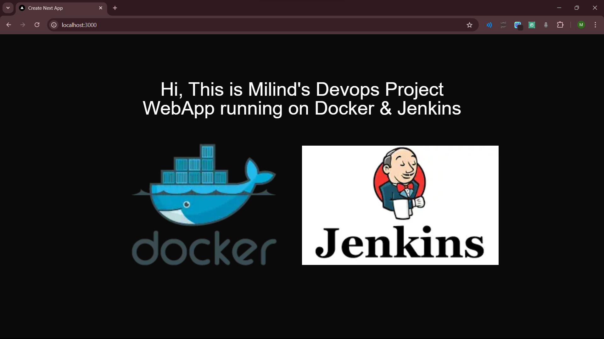
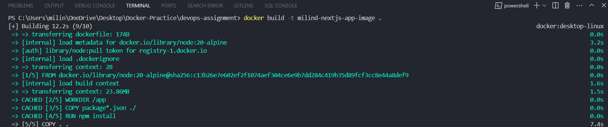
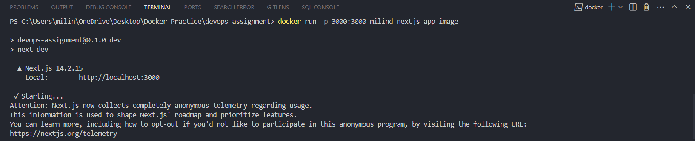
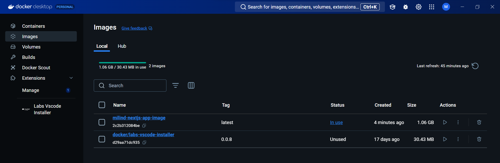
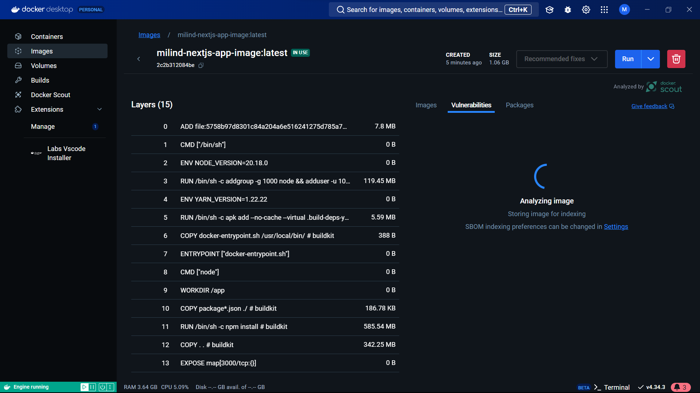

# This is my [Next.js WebApp with Docker]() project .

<div align="right" style="margin-right: 20px; font-size: 18px;">Author : Milind Murmu</div>

## Getting Started

### Prerequisites
Docker should be installed within your system. To install follow the [Docker Installation Docs](https://docs.docker.com/engine/install/)

First, to run the docker build :

```bash
docker build -t milind-nextjs-app-image .
```

Second, to start a container out of that image :

```bash
docker run -p 3000:3000 milind-nextjs-app-image
```

Lastly, Open [http://localhost:3000](http://localhost:3000) with your browser to see the result.

## Screenshots of This Project
- Running Docker Web App


- Command to build docker image

- Command to run docker container

- Docker Desktop

- Docker Desktop Showing the Image Analysis


## Learn More

To learn more about Docker, take a look at the following resources:

- [Docker Documentation](https://docs.docker.com/) - learn about Docker features and Containerisation.
- [Learn Docker](https://www.docker.com/101-tutorial/) - an interactive Docker tutorial.


