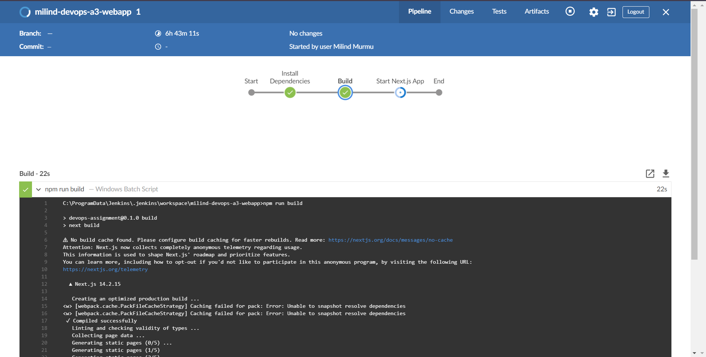
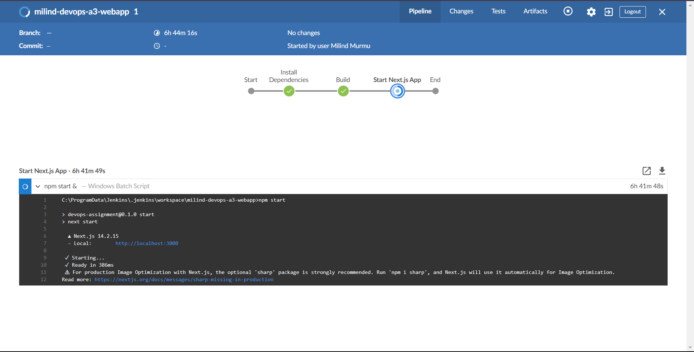

# This is my [Next.js WebApp integrated with Docker / Jenkins]() .

<div align="right" style="margin-right: 20px; font-size: 18px;">Author : Milind Murmu</div>

## Getting Started

### Prerequisites
Docker should be installed within your system. To install follow the [Docker Installation Docs](https://docs.docker.com/engine/install/)
Jenkins should be installed within your system. To install follow the [Jenkins Installation Docs]([https://docs.docker.com/engine/install/](https://www.jenkins.io/doc/book/installing/))

## Containerisation with Docker
First, to run the docker build :

```bash
docker build -t milind-nextjs-app-image .
```

Second, to start a container out of that image :

```bash
docker run -p 3000:3000 milind-nextjs-app-image
```

Lastly, Open [http://localhost:3000](http://localhost:3000) with your browser to see the result.

## Screenshots of this Project Containerised using Docker
- Running Docker Web App


- Command to build docker image

- Command to run docker container

- Docker Desktop

- Docker Desktop Showing the Image Analysis


## Learn More

To learn more about Docker, take a look at the following resources:

- [Docker Documentation](https://docs.docker.com/) - learn about Docker features and Containerisation.
- [Learn Docker](https://www.docker.com/101-tutorial/) - an interactive Docker tutorial.

## Build automation with Jenkins
First, push all your code to a GitHub/GitLab repository.
Take the GitHub link of that repository.

Second, login into your Jenkins then create a new item.
Under that select your project's name and select item type as pipeline. 
After creating the project you will be sent to the pipeline configurations page.


Third, at the bottom of the configurations page you will find a place to write down the pipeline script.
In my case, I didn't choose pipeline script from SCM rather wrote the script over there itself.

```groovy
pipeline {
    agent any
    stages {
        stage('Install Dependencies') {
            steps {
                bat 'npm install'
            }
        }
        stage('Build') {
            steps {
                bat 'npm run build'
            }
        }
        stage('Start Next.js App') {
            steps {
                bat 'npm start &'
            }
        }
    }
}
```
Over here I'm using ```bat 'npm start &'``` bat command because this will be a build for windows.
If in case you are in another Operating System like Linux use sh instead of bat eg. ```sh 'npm start &'```.


Fourth, task it too install the neccessary plugins from the jenkins manage plugins section before building this jenkins pipeline. Like in this case :
- Node js
- GitHub

Lastly, click on the build pipeline and wait for it to run.
- Stage 1: Installing Dependencies

- Stage 2: Build

- Stage 3: Deploy

- Running the same Web App but this time build and automated with Jenkins.


